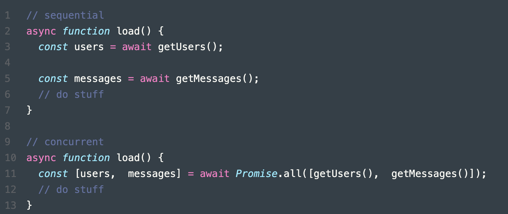
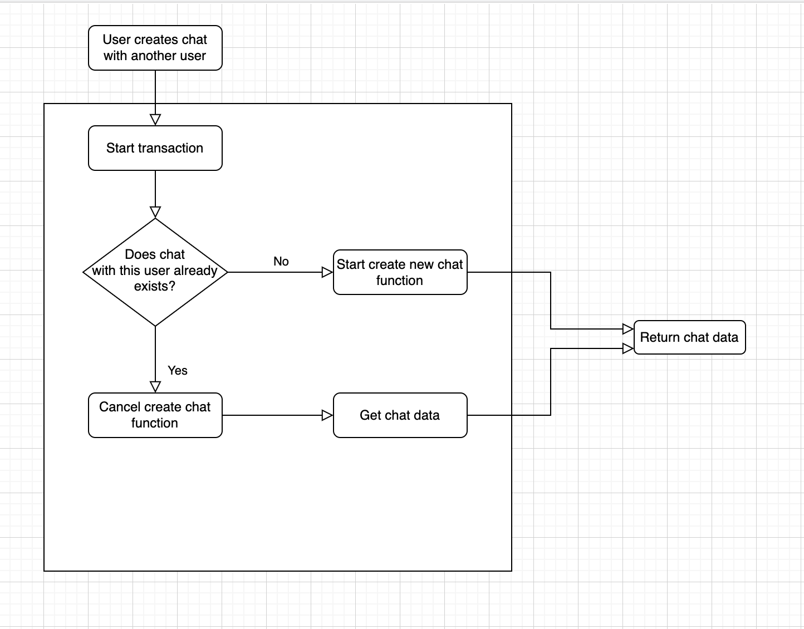

> JavaScript has a concurrency model based on an event loop, which is responsible for executing the code, collecting and processing events, and executing queued sub-tasks. This model is quite different from models in other languages like C and Java.
– MDN Web Docs

Concurrency in JavaScript is quite different from other languages we are looking at. The biggest difference is that JavaScript is single-threaded and hence multi-threading and parallelism is out of the question – at least not traditional multi-threading or parallelism like in other languages.
With JavaScript, it’s possible to do some level of multi-threaded concurrency and parallelization. It’s not as flexible as Rust or as simple as Go, but still, you can achieve almost everything possible in other languages and still get quite decent performance for most of those use cases.

# Concurrency Patterns usage:

### Asynchronous processing

Technically asynchronous programming is not part of concurrency but in practice, it goes hand in hand for many use cases and improves performance, and makes resource usage more efficient. Since the JavaScript event loop is non-blocking and asynchronous, it’s perfect for asynchronous programming and that’s why the concept is so popular among JS developers than in other languages and is heavily used especially in NodeJS and on the client-side with modern SPA frameworks. In a way, asynchronous programming was made popular by JavaScript. JavaScript provides few ways to do asynchronous programming, Callbacks, Promises, Observable, and Async/Await. This makes it easy to write concurrent applications in JS using these constructs.

### Read-write lock pattern

A read-write lock pattern is primitive for synchronization, addressing one of the readers’ writers’ difficulties. For read-only tasks, an RW lock permits concurrent access; write actions need exclusive access.

In our application if fixed a problem when 2 users are creating chat between each other in the same time.

In Firebase All writes to the database from all clients are ordered. It doesn't matter if its from a client app or the admin SDK. If there are two database clients trying to write different values to the same location in the database, the last writer in the order overwrites the previous value, which is then what all the other clients will eventually see.

So we used a transaction to ensure only one write makes it through. This would mean that the second user ends up reading the chat created by the first user, like displayed in diagram.

